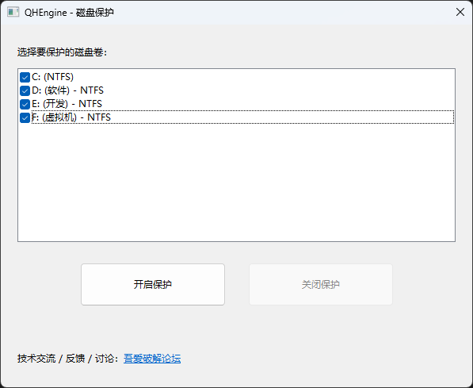

[English Version](README_EN.md)

---

# SysRestoreDriver

一个独立开发的 Windows 卷过滤**重启还原驱动**，基于写时重定向技术。开启保护后，系统盘上的任何写入都会被重定向到空闲扇区，**重启后磁盘自动恢复到保护开启时的状态**——像网吧/教室还原卡那种效果，但纯软件实现。

配套提供 MFC 用户态管理程序 `QHEngineUI`，将驱动文件作为资源嵌入 exe，一键安装、勾选要保护的卷、开启/关闭保护。



> ## ⚠️ 数据安全警告
>
> 本项目是**直接挂在卷设备栈上的内核态过滤驱动**，开启保护后会改写所有磁盘写入的目标位置。请在使用前阅读：
>
> - **务必先在虚拟机或可随时重装的测试机上试用**，不要直接在装有重要数据的机器上首次部署
> - **试用前请完整备份**（系统镜像 + 重要数据），未签名的内核驱动在未经测试的硬件 / 安全软件 / 杀软组合下可能蓝屏
> - **关闭保护必须重启**才能生效（详见 FAQ Q4），切勿在保护开启状态下直接拔电源或强制断电——`$Bitmap` 处于重定向视图，强制断电可能导致文件系统损坏
> - **状态文件 `_qh_protect_state.data` 不要手动删除**，删除等同于关闭保护，重启后所有保护期间的写入丢失
> - **如重启后进入 WinRE 修复模式**，请按下方"重启后进了 WinRE 怎么办"小节的命令救援
> - 本项目按 Apache License 2.0 协议以 **"按现状（AS-IS）"** 提供，不承担因使用本项目造成的任何数据丢失或硬件故障责任

## 适用场景

- **公用机器**：网吧、教室、图书馆、展会样机——每次重启自动回到干净状态
- **软件试用沙箱**：装一堆软件测试、改注册表、删系统文件，重启即清
- **防误操作**：家里给老人小孩的机器，怎么折腾重启都不坏

仅支持 NTFS 分区，仅在 Win10/11 上测试通过。本项目未参考微软驱动样例，全部基于 WDK 头文件从零构建，采用 Apache License 2.0 协议开源。

## 项目状态

当前版本：v0.1（首个版本，基础功能完整可用：开启/关闭保护、多卷选择、重启还原均已联调通过）

## 依赖

**零第三方依赖，纯 WDK。** 驱动只链接 Windows Driver Kit 自带的内核库（`ntoskrnl`、`hal` 等），不引入任何第三方开源组件——曾尝试移植 klib 的 khashl 哈希表，因稳定性问题剥离，同时也避免了第三方开源协议的潜在污染。

整个项目无传递性依赖，可放心集成到任何商业或开源产品中。

## 支持的平台

- Windows 10/11：已测试
- Windows 8.1/7：理论上兼容，未经测试
- 仅 NTFS 分区

## 编译环境

- Microsoft Visual Studio Enterprise 2022（64 位）17.14.31（April 2026）
- Windows SDK 10.0.26100.0
- Windows Driver Kit (WDK) 10.0.26100.0

## 编译步骤

1. 打开 `SysRestoreDriver.sln`
2. 选择 Release / x64
3. 生成解决方案

构建产物：
- `SysRestoreDriver.sys` — 驱动二进制
- `QHEngineUI.exe` — MFC 用户态管理程序（已将 .sys 与 .inf 作为资源嵌入）

## 部署与加载

1. 开启测试模式（管理员终端）：`bcdedit /set testsigning on`
   > 当前版本未做代码签名，必须在测试模式下加载。开启后桌面右下角会出现"测试模式"水印属于正常现象。生产环境部署需购买 EV 代码签名证书做内核驱动签名
2. 重启
3. 以管理员身份运行 `QHEngineUI.exe`
4. 在卷列表中勾选要保护的卷，点击"开启保护"
5. 重启 — 保护生效

关闭保护：在 `QHEngineUI.exe` 中点击"关闭保护"，重启即恢复正常读写。

### 重启后进了 WinRE 怎么办

开启保护时 UI 会调用 `bcdedit` 配置启动失败策略避免进入 WinRE。如果配置失败或异常情况下重启进入了 WinRE 修复模式，可在 WinRE 命令行执行以下命令救援：

```
bcdedit /set {default} bootstatuspolicy DisplayAllFailures
bcdedit /set {default} recoveryenabled Yes
```

## 保护状态文件方案

为解决"卷过滤驱动开启后，保护状态如何持久化"的问题，本项目采用**文件方案**：

- 开启保护时，UI 在每个被保护卷的根目录创建 `_qh_protect_state.data`（1MB，隐藏 + 系统属性），首字节写 `1`
- 该文件被驱动加入 `ProtectRanges`（直写放行扇区列表），对其读写直通真实磁盘，不被重定向
- 驱动启动时读取该文件首字节决定是否激活保护：`1` = 开启，`0` = 关闭，文件不存在 = 未配置
- 关闭保护时，UI 直接把首字节改写为 `0`，重启后驱动读到 `0` 即不激活

不依赖注册表存储保护状态。详细原理见[架构设计](ARCHITECTURE.md)第 5 节。

## 测试记录

| 系统版本 | NTFS 版本 | 场景 | 结果 |
|---|---|---|---|
| Win10 22H2 | 3.1 | 正常写入后重启 | 通过 |
| Win11 23H2 | 3.1 | 异常断电模拟后重启 | 通过 |
| Win11 23H2 | 3.1 | 开启/关闭保护重启循环 | 通过 |

## FAQ

### Q1：性能损耗有多大？

在 Win10 22H2 / NVMe SSD / 60GB 系统盘上用 CrystalDiskMark 8.0.4 实测（1 GiB × 5 轮）：

| 项目 | 保护关闭 | 保护开启 | 变化 |
|---|---|---|---|
| SEQ Q8 1MiB **Read** | 1753 MB/s | 1510 MB/s | −14% |
| SEQ Q1 1MiB **Read** | 1170 MB/s | 685 MB/s | **−41%** |
| RND Q32 4KiB **Read** | 18.3 MB/s | 18.5 MB/s | +1%（噪声） |
| RND Q1 4KiB **Read** | 11.2 MB/s | 10.8 MB/s | −4% |
| SEQ Q8 1MiB **Write** | 673 MB/s | 436 MB/s | −35% |
| SEQ Q1 1MiB **Write** | 916 MB/s | 373 MB/s | **−59%** |
| RND Q32 4KiB **Write** | 19.2 MB/s | 10.1 MB/s | −47% |
| RND Q1 4KiB **Write** | 10.9 MB/s | 10.2 MB/s | −6% |

<details>
<summary><b>复现方法</b></summary>

- 测试工具：CrystalDiskMark 8.0.4 x64，Profile = Default，Test = 1 GiB × 5 轮，间隔 5 秒
- 测试目标卷：系统盘 C:（NVMe SSD），保护开启前已用容量 39%，开启后 38%（数据基本一致）
- 测试顺序：
  1. 关闭保护状态下重启系统，等待桌面就绪 60 秒后执行第一组测试
  2. 在 `QHEngineUI` 中开启保护，重启系统，等待桌面就绪 60 秒后执行第二组测试
- 两组测试均在 Administrator 模式下运行，关闭杀毒软件实时扫描以避免引入额外 IO 干扰

</details>

**结论**：
- **读路径**：低队列深度顺序读损失最大（SEQ Q1 约 −41%），瓶颈在逐扇区查 Splay 树判断重定向；高队列深度因并发掩盖，损失收敛到 −14%
- **写路径**：顺序大块写损失较大（约 −35%），瓶颈在防御性的 1 MiB 缓冲区拷贝 + 同步等待每段 IO 完成
- **小 IO 几乎无损**：Q1 4KiB 读写均 < 6%

未对比同类商业方案（Deep Freeze / PowerShadow 等），这类软件厂商不公开基准数据、第三方独立评测也极少，无可信参照。如读者手头有可复现的对比数据，欢迎反馈。

后续优化方向：开发期间试过几条路（锁合并、读路径整段直通判断、异步 IO 流水线），CDM 这种 SEQ 场景下基本都没收益——详见 [ARCHITECTURE.md 附录](ARCHITECTURE.md#附录开发期试过但放弃的优化)。真正的瓶颈在防御性缓冲区拷贝和同步 IO 等待这两块，后面可能要从这两个方向想办法。

### Q2：内存占用有多大？

内存占用与**卷大小**和**实际写入量**有关：

- **扇区位图**（`SectorBitmap`）：基于 Windows 内核 `RTL_BITMAP` 的薄包装，创建时按卷总扇区数一次性分配整块缓冲区
  - 每 1 TB 卷 ≈ 256 MB（512B 扇区下，每扇区 1 位）
  - 每 100 GB 卷 ≈ 25 MB
  - 60 GB 系统盘 ≈ 15 MB
- **直写放行区间表**（`ProtectRanges`）：静态嵌入 DEVICE_EXTENSION 的小数组，仅记录 `_qh_protect_state.data` 与 `$Volume` MFT#3 主/镜的扇区，固定 ≤ 128 字节
- **偏移记录表**（Splay 树）：每条映射约 40 字节。100 万次首次重定向 ≈ 40 MB
- **典型场景**（200 GB 系统盘，单次开机写入 5 GB 数据）：总内存占用约 **70–100 MB**

驱动内存全部走 `NonPagedPool`（不可分页），属于宝贵的内核内存。极端写入场景下需注意。

### Q3：能否保护非系统盘 / 多个卷？

**可以**。驱动作为 Volume Upper Filter 注册（见 [SysRestoreDriver.inf](SysRestoreDriver/SysRestoreDriver.inf) 的 `FilterClass = Volume`），系统挂载任何 NTFS 卷时都会附加过滤设备：

- 系统盘、数据盘、移动硬盘、U 盘均可保护
- 每个卷独立判断：根目录有 `_qh_protect_state.data` 且首字节 = 1 才激活
- 动态插拔介质（U 盘等）走 `IOCTL_VOLUME_ONLINE` 路径单独初始化
- UI 列出所有卷供勾选，未勾选的卷完全透传不受影响

**注意**：仅 NTFS 分区有效。FAT32 / exFAT 卷会被驱动跳过（无法解析 `$Bitmap`）。

### Q4：能否不重启关闭保护？

**当前版本：不能。关闭保护必须重启才能生效。**

原因来自架构本身：
- 保护开启期间，磁盘上的 `$Bitmap`、`$MFT` 等元数据已经"冻结"在保护开启那一刻
- 内存中的偏移表记录了"哪些扇区被重定向到哪里"，文件系统和应用看到的是这个映射叠加后的视图
- 如果运行时直接卸载驱动 → 文件系统瞬间看到磁盘真实数据（保护开启时的快照）→ 当前打开的文件全部错乱 → **必然蓝屏**
- 唯一安全的关闭路径：UI 把状态文件首字节改成 0 → 重启 → 驱动初始化时读到 0 → 不激活保护 → 全卷正常读写

理论上可以实现"在线提交（commit）"——把内存中所有重定向数据回写到原始扇区然后卸载，但这会带来：
- 需要暂停全卷 IO（实质上是停机维护）
- 提交过程中断电会导致文件系统损坏
- 提交完成后无法回滚

考虑到目标场景（网吧、教室、试用沙箱）本身就以"重启换干净"为卖点，重启关闭是符合产品定位的设计选择，不计划实现在线提交。

*注：以上测试均在固定配置的虚拟机中完成，耗时不足10分钟，不构成任何稳定性或兼容性承诺。

## 已知限制

- 仅支持 NTFS 分区，暂不支持 FAT32/exFAT 等其他文件系统
- 暂未处理文件删除导致的重定向空间回收问题
- **状态文件 `_qh_protect_state.data` 可被用户手动删除**——删除后等同关闭保护，目前未做删除防护（后续考虑用 minifilter 监控）
- 当前使用 Splay 树（`RTL_GENERIC_TABLE`）存储偏移映射，非最优性能方案，未来计划替换为自实现的哈希表

## 版权与许可

本项目采用 Apache License 2.0 协议开源，版权归 Xuhui Jiang 所有。
完整许可证文本见 [LICENSE](LICENSE) 文件，项目署名信息见 [NOTICE](NOTICE) 文件。

## 联系方式

欢迎通过 GitHub Issues 提交问题、反馈与 PR。

## 相关文档

- [架构设计](ARCHITECTURE.md)
